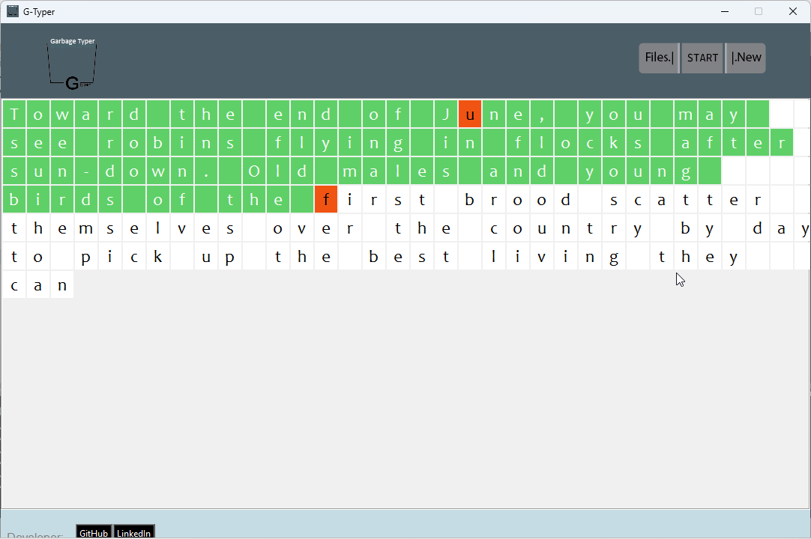
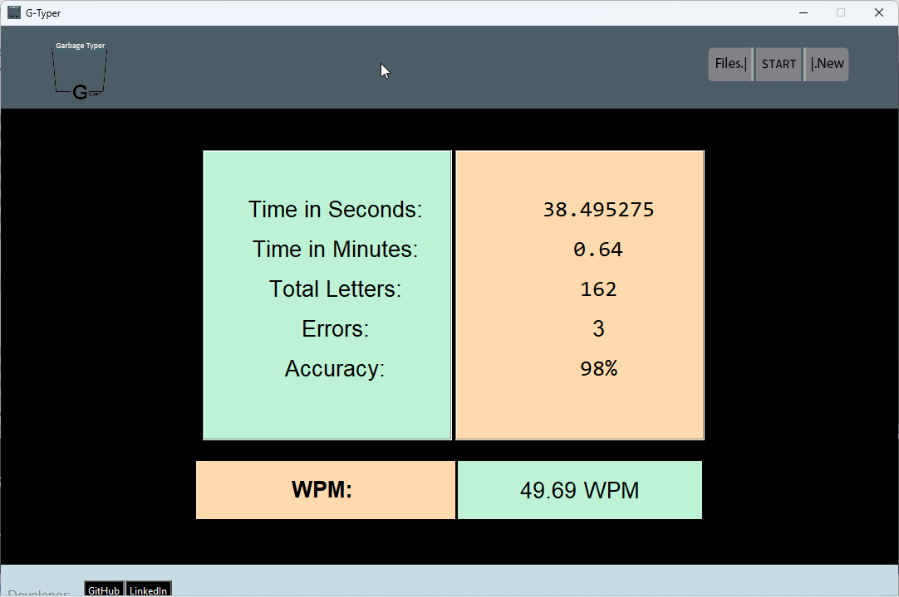
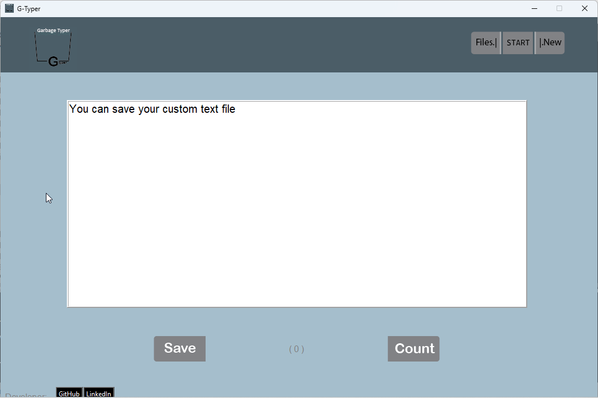
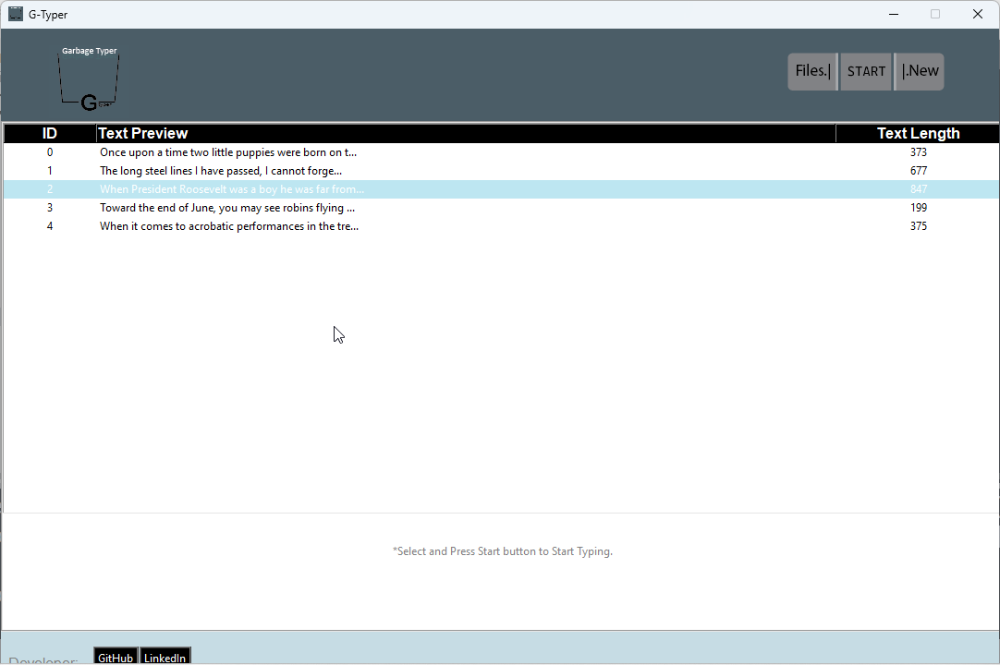

# Garbage Typer
****

This project is made for fun 
and exploration of Tkinter module

This is a GUI based typing app in which  
you can practice your 
typing speed
  

## Features
- You can Measure your typing speed in this application  
  and also get detailed data like **Total Time, WPM, Error etc.**
     
  
  

   

- You can also add custom text file to  
  practice according your need 
     
  
  

--------
**Linkedin:** **https://www.linkedin.com/in/pankaj-vishw-4802a9232/**

